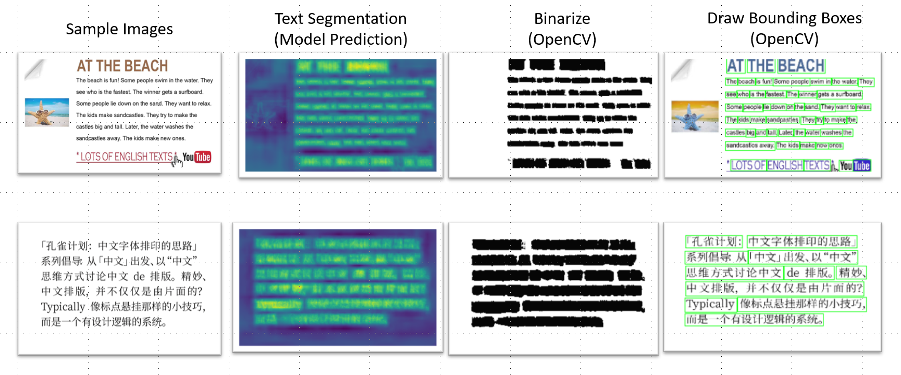

# OpenVINO-Demo-2022-Applications

# Installation Instructions 
You can found the OpenVINO Introduction Repo in the link below  
https://github.com/CJsGit-tech/OpenVINO-Demos-2022

### OpenVINO Pre-trained Model Application Demos
I came up with three applications and the source codes are now on Github. Nonetheless, the applications are not built for production environment, instead the code resembles as a starting point of major applications.   Before introducing the applications, make sure to click on the link above and setup OpenVINO.

### Downloading a model(s)
Link to OpenVINO Model Zoo: 
https://docs.openvino.ai/2021.4/model_zoo.html

##### Example of downloading a model
<ol>
 <li>Initiate OpenVINO Environment:<path to OpenVINO>\bin\setupvars.bat </li>
 <li>Go to the path below:<path to OpenVINO>\deployment_tools\tools\model_downloader</li>
 <li>In your command line interface:python downloader.py --name "<model_name>" --precisions "<model_precision>" --output_dir "<path_to_your_desired_directory>"</li>  
</ol>
   
Example: 
python downloader.py  
 - name "person-vehicle-bike-detection-crossroad-yolov3–1020"  
 - precisions "FP16"   
 - output_dir "E:\TensorFlow\TensorFlow Projects\Project 005-TensorFlow with OpenVINO\model" 
   
### Application Demos

Car Counting Demo 
Model(s):  
person-vehicle-bike-detection-crossroad-1016 
Description:  
The goal of this application is to create an automated system that can perform real-time traffic monitoring. An extension of this application could be building a reinforcement learning AI that controls traffic lights. In other words, we can have AIs decide how the traffic flows which could improve overall traffic during rush hours. 
 
 
   
Real-time Face Detection and Face Filter with StyleGAN  
Model(s):  
face-detection-retail-0005  
emotions-recognition-retail-0003  
style-GAN  
Description:  
The goal of this application is to demonstrate that OpenVINO has models that can perform   
1) real-time face detection with masking using StyleGAN   
2) emotion recognition.   
These models are really common in our day-to-day lives. We see all smartphones now have face detection algorithms built into cameras. We see lots of different face filters in photoshop applications.  
 
 
   
Text Detection and Eng Text Recognition 
Model(s): 
text-detection-0004 
text-recognition-0014 (English Only) 
Description: 
The goal of this application is to demonstrate that OpenVINO has models that can perform Text Detection in images. There are also quite a few applications that are built upon the use of text detection models. For instance, inserting credit card information. In the past, manually typing the numbers and pins are necessary but more and more applications now allow the users to take a picture of the card! The information will be filled in automatically. 
  
   
   
Side Note: 
You will be able to find the text recognition part of the code in the Github repo.  
Some other model demonstration results can be found in the YouTube Link Below. 
https://www.youtube.com/watch?v=zKSspzZRGTk&t=94s
